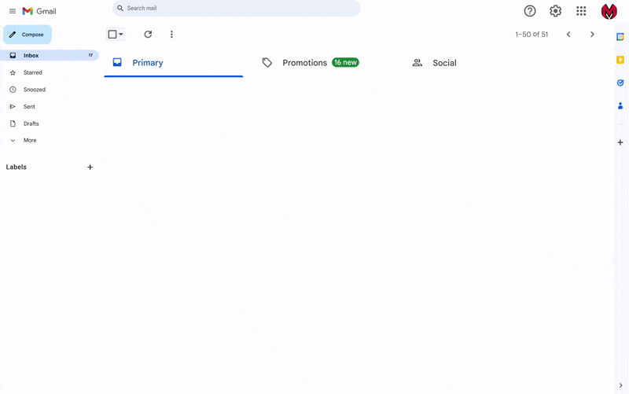

# AI-Powered Gmail Organizer

## Overview

The **AI-Powered Gmail Organizer** is a tool that uses FastAPI and GPT-based models to automate the categorization and labeling of incoming emails. It integrates with the Google Gmail API to dynamically organize your inbox based on user-defined criteria and AI analysis.

## Features

- **Automated Email Labeling**: Automatically labels emails based on their content and sender.
- **User-Defined Criteria**: Allows customization of email filtering rules.
- **AI-Powered**: Uses GPT-based models for intelligent email content analysis.
- **Integration with Gmail API**: Seamlessly integrates with Gmail to manage emails.
- **Bulk Email Remove** Removes A big amout of mails sent by a speciifc user or recent emails.
